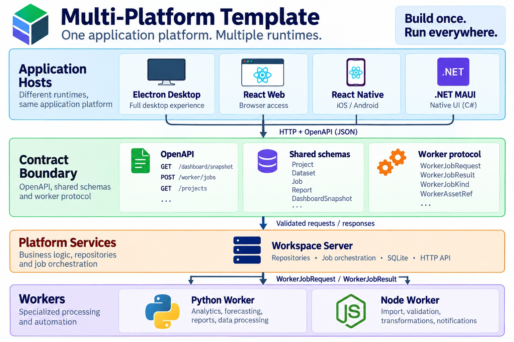
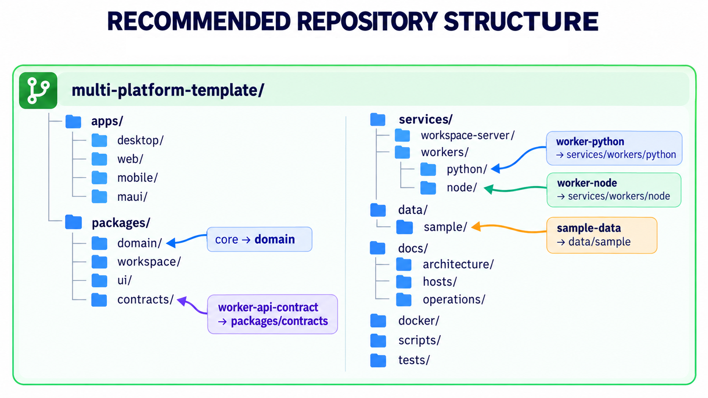
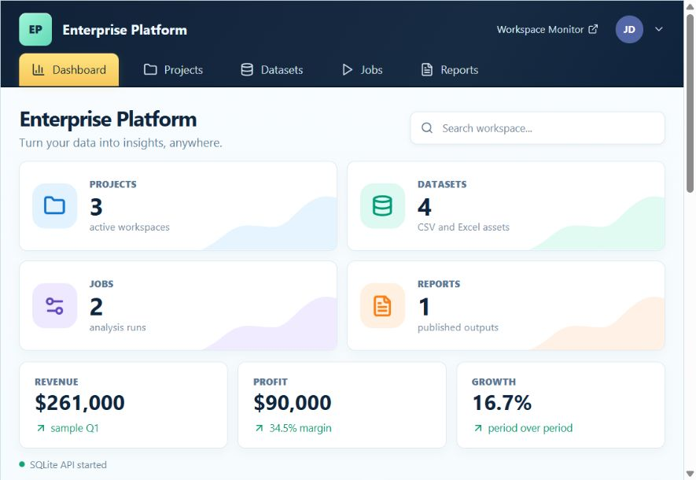
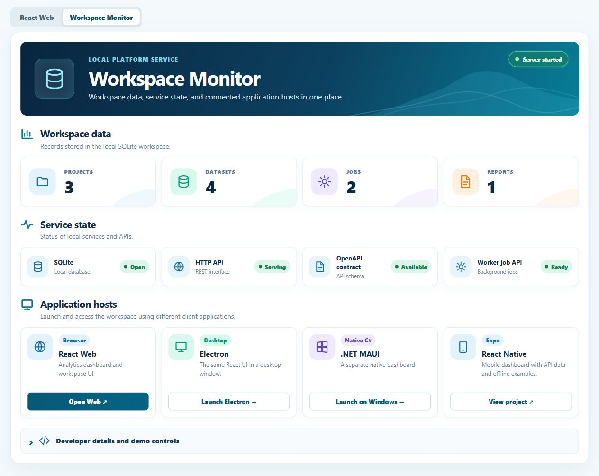

# Multi-Platform Template

This repository is a template for building desktop, web, mobile, service, and worker applications from a shared platform core. Instead of duplicating business logic for each application, the architecture shares the domain model, repository abstractions, service layer, OpenAPI contracts, worker protocols, and deployment strategy across every host.

The same React interface runs in a browser and inside Electron, while .NET MAUI provides a separate native dashboard. Those hosts use a shared HTTP and OpenAPI boundary to reach workspace data. The Expo/React Native mobile shell reads that API when reachable and falls back to bundled demo data. Python and Node workers handle analytics and automation tasks.



The source tree follows those responsibilities: `apps` contains the hosts, `packages` holds shared code and contracts, and `services` contains the workspace server and workers. Sample data, documentation, deployment files, scripts, and tests have their own top-level directories.



It keeps the same practical boundaries:

- `apps/desktop` - Electron shell that loads the web UI and starts the local workspace server.
- `apps/web` - Enterprise Platform Web, a React browser host for the analytics dashboard and workspace UI.
- `apps/mobile` - Expo/React Native mobile shell.
- `apps/maui` - optional .NET MAUI native shell for Windows, Android, iOS, and Mac Catalyst.
- `packages/domain` - shared domain model and analytics logic.
- `packages/contracts` - shared OpenAPI and TypeScript request/result contract for platform shells and workers.
- `packages/ui` - shared React UI primitives.
- `packages/workspace` - repository layer for projects, datasets, jobs, reports, and users.
- `services/workspace-server` - local HTTP API over the shared SQLite repository.
- `services/workers/python` - Pandas worker for KPI, trend, and report generation jobs.
- `services/workers/node` - Node worker for CSV import, validation, transformations, notifications, and email generation.
- `data/sample` - CSV business data for sales, inventory, and production examples.
- `data/sample/real` - larger real-world retail datasets extracted from user-provided archives.
- `docker` - containerized worker/runtime entrypoints.
- `docs` - architecture and platform notes.

## Application Preview

Run `npm install` and then `npm run dev:web` from the repository root. This starts the React app and the local Workspace Server on separate ports. Each view links to the other and opens it in a new browser tab.

### React Web — application dashboard

Open [React Web at 127.0.0.1:5184](http://127.0.0.1:5184/). The dashboard brings projects, datasets, jobs, and reports together with revenue, profit, and growth cards. Search filters the workspace lists; each count card opens its corresponding view. Import a CSV, queue KPI, trend, or HTML report work, then follow job status and open generated reports. Electron loads this same React interface in a desktop window.



### Workspace Monitor — local server

Open [Workspace Monitor at 127.0.0.1:8797](http://127.0.0.1:8797/). It shows the local SQLite workspace counts, service state, and application hosts. The React Web, Electron, .NET MAUI, and React Native cards explain how to access each host; developer links and demo controls are in the expandable section.



The monitor is an operations view for the local Workspace Server. .NET MAUI has its own native window; the Expo/React Native starter shows API data when connected and bundled examples when offline. The screenshots show the seeded example workspace, so counts may differ after you add data.

## Platform Stack

- Desktop: Electron + React.
- Web: Vite + React.
- Mobile: Expo + React Native.
- Native cross-platform: .NET MAUI.
- Shared code: TypeScript workspace packages.
- Cross-runtime contract: OpenAPI for TypeScript, C#, workers, and native shells.
- Application database: SQLite behind the local workspace server.
- Business data: CSV files imported by users.
- Worker: Python + Pandas for analytics.
- Worker: Node for JavaScript-native workflow automation.
- Reports: JSON for machine-readable results, HTML/PDF-ready summaries for executives.

## Data Model

SQLite stores application state:

- `projects`
- `datasets`
- `jobs`
- `reports`
- `users`

CSV and Excel files store business facts:

- sales revenue and cost
- inventory stock and reorder levels
- production output and downtime
- real retail transactions and Superstore orders

## Run

Install dependencies:

```bash
npm install
python -m pip install -r services/workers/python/requirements.txt
```

Start Enterprise Platform Web:

```bash
npm run dev:web
```

To try the complete flow, open React Web, choose **Import CSV**, and select `data/sample/online-retail.csv`. Open **Jobs**, select the imported dataset, and choose **Run KPI**. When its status becomes **succeeded**, use **Open report**; **Generate HTML** creates a browser-readable report from the same dataset. Imported files, job states, and generated reports are stored under `.workspace/` and recorded in SQLite.

Run the isolated API workflow check with `npm run test:flow`. The shared contract check is `npm run check:openapi`.

Start only the local workspace server:

```bash
npm run workspace-server
```

Start the desktop app:

```bash
npm run dev:desktop
```

Start the mobile app:

```bash
npm run dev:mobile
```

Restore and run the .NET MAUI app on Windows:

```bash
npm run restore:maui
npm run dev:maui
```

Run a sample KPI job:

```bash
python services/workers/python/service/main.py --job kpi --input data/sample/online-retail.csv --output reports/kpi-analysis.json
```

Run KPI jobs against the real imported datasets:

```bash
python services/workers/python/service/main.py --job kpi --input data/sample/real/superstore-sales/train.csv --output reports/superstore-kpi-analysis.json
python services/workers/python/service/main.py --job kpi --input "data/sample/real/online-retail/Online Retail.xlsx" --output reports/online-retail-kpi-analysis.json
```

Run Node workflow jobs:

```bash
npm run worker:node:import
npm run worker:node:validate
npm run worker:node:email
```

Check the OpenAPI contract:

```bash
npm run check:openapi
```

The shared contract is documented in `docs/architecture/shared-contract.md`. The workspace server is documented in `docs/operations/workspace-server.md`. The .NET MAUI native shell is documented in `docs/hosts/maui.md`.

Run Enterprise Platform Web in Docker:

```bash
npm run docker:web:build
npm run docker:web:run
```

Or use Compose:

```bash
npm run docker:compose
```

## Architecture Flow

```text
CSV import
  -> Asset Browser
  -> Workspace Server
  -> SQLite metadata
  -> Worker Job
  -> Analysis result
  -> Report
  -> Dashboard
```

Platform apps use the same local HTTP contract:

```text
Web / Electron / MAUI
  -> http://127.0.0.1:8797
  -> packages/workspace repository
  -> SQLite
```

The Expo/React Native starter fetches the shared snapshot when the Workspace Server is reachable. Set `EXPO_PUBLIC_WORKSPACE_API_URL` to a reachable server URL when running on a physical device; see [mobile setup](apps/mobile/README.md).

The starter UI shows:

- project, dataset, job, and report counts
- revenue, profit, and growth cards
- dataset/job/report lists
- realistic enterprise job types: KPI Analysis, Trend Analysis, Report Generation
- real sample datasets: Online Retail and Superstore Sales

## Worker Split

Python worker:

- Pandas / NumPy / Polars-style analytics
- forecasting
- CSV and Excel processing
- PDF or HTML reports

Node worker:

- CSV import previews
- data validation
- lightweight transformations
- notifications
- email draft generation
